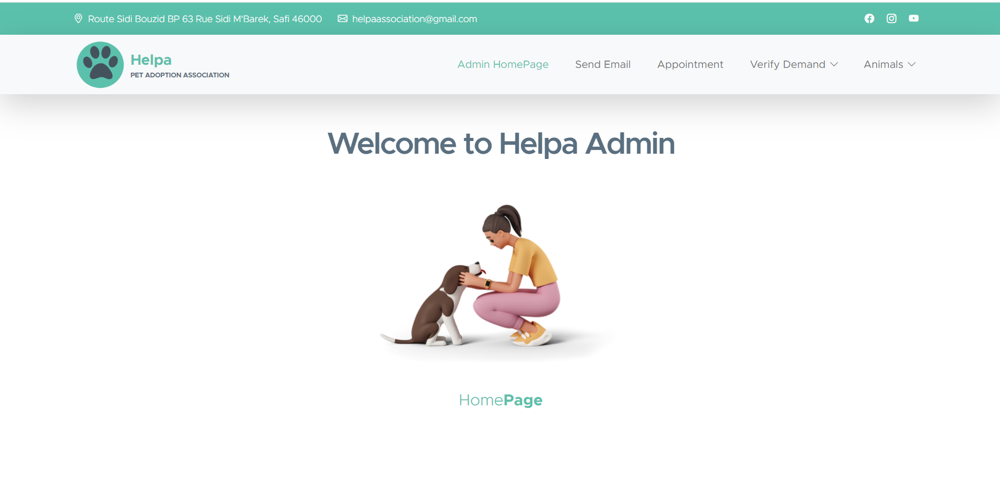

---

# Pet Adoption Website Project🐾🐶🐱

## Project Overview
Welcome to Helpa🐾,a Pet Adoption Website🐶🐱! This project was created with the goal of simplifying the process of pet adoption, volunteering, and donations for animal shelters. It features a user-friendly interface for prospective pet owners, volunteers, and donors, as well as an admin side for managing animals and verifying adoption requests.

## Motivation
Consider this: In Morocco, three million cats and dogs are abandoned, often in dire situations<sup id="fnref1"><a href="#fn1"> 1  </a></sup>.

This project was developed out of a passion for animal welfare and a desire to make a positive impact on the community. We believe that every pet deserves a loving home, and this website is a step towards making the adoption process more accessible and efficient.

❝ Our platform could change this, one adoption at a time. ❞

## Features
- **User Side** 🧑🏻‍💻:
  - Browse and adopt pets
  - Sign up to become a volunteer
  - Make donations to support the shelter

- **Admin Side**👨🏻‍💼:
  - Add new animals available for adoption
  - Manage and verify adoption requests
  - Oversee volunteer and donation activities

## Technology Stack
- **Frontend**: HTML, CSS, JavaScript,Bootstrap
- **Backend**: Php
- **Database**: Mysql
- **Additional Tools**: Git, GitHub, Visual Studio Code

## View the presentation

Check out our project presentation below for a detailed overview:

<a src="https://www.canva.com/design/DAGF9J9FBHc/1lX_MZEF2vlyTSNY-TKaYA/edit"/>
<a href="https://www.nationalgeographic.com/animals/article/meet-the-people-helping-morocco-stray-dogs">view here 👩‍🏫</a> 

## Video Demonstration
To get a comprehensive overview of the website's functionalities and design, please watch our 10-minute [Video Demonstration](https://www.linkedin.com/posts/ihssanenedjaoui_petadoption-animalwelfare-techforgood-activity-7220083904739766273-tzBc?utm_source=share&utm_medium=member_desktop).

## Screenshots
Here are some screenshots showcasing different aspects of the website:

### Home Page
Home Page link 🐕:
https://ihssane5.github.io/Pet-Adoption-Website-Project/

### Pet Listing


### Volunteer Sign-up


### Admin Dashboard


## Installation and Usage
To run this project locally:
1. install Xampp: https://www.apachefriends.org/download.html(Xampp installation should be on your C drive)

2. change the default port for mysql server to 3308:
https://www.youtube.com/watch?v=xY7Vbjdus_0

3. navigate to C:\xampp\htdocs 
    ```bash
   cd C:\xampp\htdocs 
   ```

4. Clone the repository:
   ```bash
   git clone https://github.com/your-username/pet-adoption-website.git
   ```
5. extract mini_projet and mini_projet_f from mini_projet.zip and mini_projet_f.zip respectively and place them in this directory **C:\xampp\htdocs**

6. run Apache and Mysql Server from Xampp control Panel:
https://www.youtube.com/watch?v=VCHXCusltqI go directlt to [3:16]

7. open your browser and navigate to:
http://localhost/mini_projet/Home.html

8. Start Your journey 🚀 and let some feedbacks 


## Future Enhancements
We have plans to further enhance the website by adding:
- Other Functionalities for donations
- Live chat support for prospective adopters
- Adding responsivity to our website

## Contributing
We welcome contributions!

## License
This project is licensed under the MIT License. See the [LICENSE](./licence) file for more details.

## Acknowledgements
Special thanks to our project mentors and everyone who provided feedback and support during the development of this project.

Special thanks to https://templatemo.com/tm-581-kind-heart-charity for the awesome template🤩

---
Footnotes:
<li id="fn1">The Original Article <a href="https://www.nationalgeographic.com/animals/article/meet-the-people-helping-morocco-stray-dogs">click here📄</a> <a href="#fnref1">↩</a></li>
